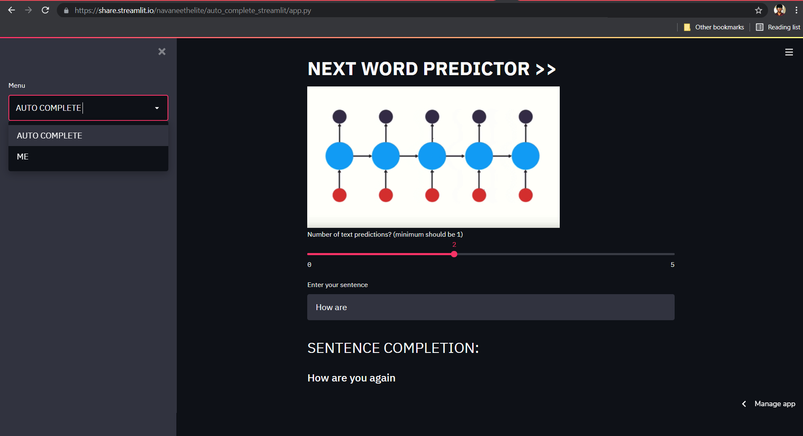

## AUTO_COMPLETE_STREAMLIT

- Lazy of typing the whole sentence?? Use my <b> TEXT AUTO COMPLETION </b> app. But the output won't be that accurate LOL😅. This BI-LSTM model was trained on just 3500 lines of text. (just to learn the model building and deployment)
- UI - guarded by Streamlit.
- This application was deployed to Streamlit Sharing.
- <strong><b> APP LINK : https://share.streamlit.io/navaneethelite/auto_complete_streamlit/app.py</b></strong>

### REQUIREMENTS:

* Python 3.7+
* tensorflow == 2.3.0
* streamlit == 0.86.0

### CREATING VENV IN CONDA:
```sh
conda create --name myenv
```
Using a virtual environment:
```sh
conda activate myenv
```
Deactivating a virtual environment:
```sh
conda deactivate myenv
```
### INSTALLING DEPENDENCIES:
TENSORFLOW:
```sh
pip install --user --upgrade tensorflow
```
STREAMLIT:
```sh
pip install streamlit == 0.86.0
```

### RUNNING THE APPLICATION:
run :
```sh
streamlit run app.py
```
- Your app will be running in the local server.
- Then deploy the app to Heroku or some other platforms you like!
- This app was deployed to Streamlit Sharing. (Request for the invite to deploy the app wait for atmost 12 hours)
- The home page of the web app is shown below:
<div class="row">
    
</div>
